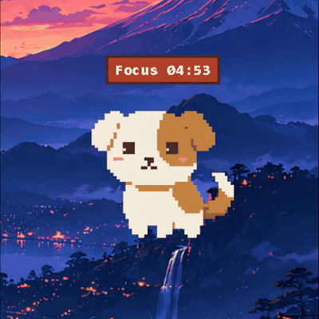
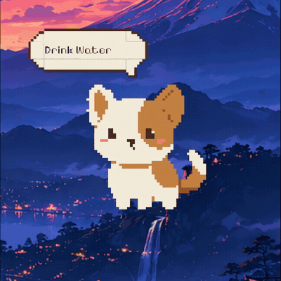
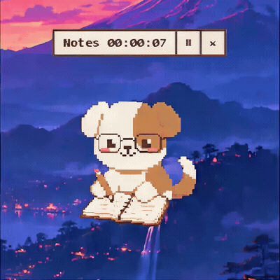
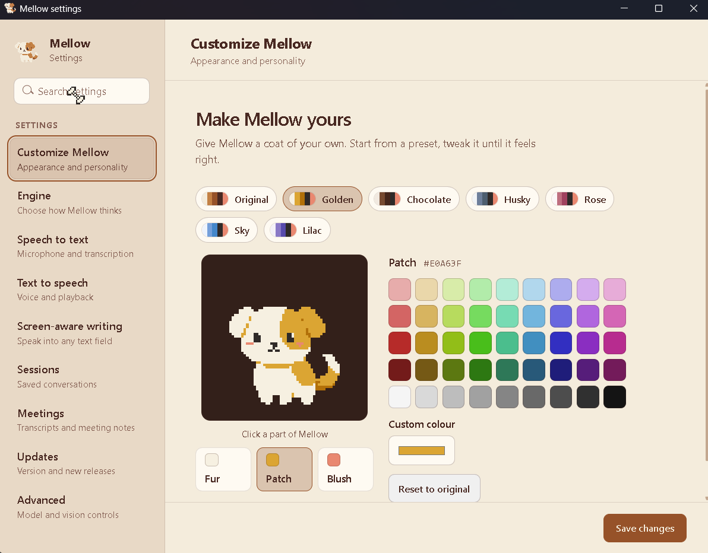

<p align="center">
  
</p>

<h1 align="center">Mellow</h1>

<p align="center">
  <strong>A small pixel-art dog who lives on your Windows desktop.</strong><br />
  Talk naturally, ask for help, stay focused, or keep him around just for company.
</p>

<p align="center">
  
  
  <a href="LICENSE"></a>
</p>

Mellow is an open-source desktop companion with a real personality and a useful set of hands-free tools. He can listen and answer out loud, understand what is on your screen, point you toward controls, open apps and websites, manage focus sessions and reminders, transcribe meetings, and react with expressive pixel-art animations.

You choose how much intelligence Mellow has and where it runs. Use local models, connect an OpenAI-compatible provider, use an existing Claude Code or Codex subscription, or disable AI entirely and keep only the pet.

## Mellow Demo

https://github.com/user-attachments/assets/8cb9e786-4c55-4077-bd6f-3200aedc5f61

## What Mellow can do

- **Talk naturally.** Hold `Ctrl` + `Shift` + `Space`, speak, and hear Mellow answer out loud.
- **See when invited.** Mellow can inspect the active screen for questions such as “what is this?” without continuously recording it.
- **Point things out.** Ask where a control is and Mellow's bone pointer moves to the relevant place on screen.
- **Help around the desktop.** Open apps, folders, and websites, play media, or adjust one application's volume.
- **Write for you.** Put your cursor in any text box, speak, and Mellow types it in. He never presses Enter, so nothing sends until you do.
- **Keep you on track.** Set reminders and run configurable Pomodoro focus sessions directly from the pet.
- **Take meeting notes.** Transcribe your microphone and meeting audio, generate structured notes with your chosen answer engine, and export the transcript or notes.
- **Feel alive.** Pet, drag, wake, and watch Mellow react through idle, listening, thinking, talking, sleeping, peeking, and stretching animations.
- **Look how you like.** Recolour Mellow's coat so he stays easy to see against your wallpaper.
- **Stay up to date.** Check for new versions and install them without leaving the app.
- **Work without AI.** Pet-only mode keeps the companion, reminders, and focus tools without downloading models or contacting an AI service.

## Mellow in action

<table>
  <tr>
    <th width="33.33%">Cursor tracking</th>
    <th width="33.33%">Petting</th>
    <th width="33.33%">Hunt mode</th>
  </tr>
  <tr>
    <td></td>
    <td></td>
    <td></td>
  </tr>
  <tr>
    <td align="center"><sub>His eyes follow your cursor around the desktop.</sub></td>
    <td align="center"><sub>Give him a pet and watch the hearts appear.</sub></td>
    <td align="center"><sub>Move quickly and Mellow gives chase.</sub></td>
  </tr>
  <tr>
    <th>Shake reaction</th>
    <th>Pomodoro timer</th>
    <th>Reminders</th>
  </tr>
  <tr>
    <td></td>
    <td></td>
    <td></td>
  </tr>
  <tr>
    <td align="center"><sub>Shake him around and he lets you know.</sub></td>
    <td align="center"><sub>Stay focused with work and break sessions.</sub></td>
    <td align="center"><sub>Set reminders and Mellow gets your attention.</sub></td>
  </tr>
  <tr>
    <th>Peek mode</th>
    <th>Meeting notes</th>
    <th>Stretch &amp; yawn</th>
  </tr>
  <tr>
    <td></td>
    <td></td>
    <td></td>
  </tr>
  <tr>
    <td align="center"><sub>Need some space? Mellow tucks himself against the screen edge.</sub></td>
    <td align="center"><sub>Stay in the conversation while Mellow takes notes.</sub></td>
    <td align="center"><sub>A little stretch and a big yawn between tasks.</sub></td>
  </tr>
</table>

## Let Mellow point the way

Sometimes “look in the top-right corner” is not enough. Ask Mellow where something is, and his **bone pointer** moves across your screen to show you the relevant control, with a short explanation beside it.

Hold `Ctrl` + `Shift` + `Space` and try:

- “Where is the settings button?”
- “Show me the export option on this page.”
- “Where do I click to change this setting?”

Mellow uses available interface information, on-screen text, and screen understanding to locate the target. While he explains it aloud, the pointer and its dialogue stay visible until the spoken response finishes, then the bone returns to following your cursor. Pointing is a visual guide, not an automatic click: you stay in control of what happens next.

Keep the relevant window visible when asking. For screenshot-based help, choose a vision-capable answer model and allow screenshot inspection under **Settings → Advanced**. Screenshots are taken when needed for your request, not continuously; cloud-based screen understanding sends them to your selected provider. Small icons, unusual layouts, or a page that changes after capture can affect pointing accuracy.

## Write with your voice

Talk instead of typing, anywhere on your desktop. Put your cursor where the words should go, hold `Ctrl` + `Shift` + `Space`, say what you want, and let go.

Mellow handles both jobs you would expect:

- **Dictate it.** Say it word for word and it lands as you said it.
- **Or describe it.** Ask for “a reply saying I’ll be twenty minutes late” and Mellow drafts it with your chosen answer engine.
- **Fix it.** Ask again while you have not touched the text and he revises what he wrote instead of starting over.

It works in documents, email, chat apps, and terminal prompts.

Because this types into other applications, it is careful by design. Mellow **never presses Enter**, so nothing sends, submits, or runs until you do it yourself. He only writes into the field you already chose, and never clicks or moves your cursor. If he cannot confirm the text landed, he hands you a draft to copy instead. Password and read-only fields are refused outright.

This is off until you turn it on, under **Settings → Screen-aware writing**.

## Make Mellow yours

<p align="center">
  
</p>

Mellow sits on your wallpaper all day, and one coat does not suit every desktop. Click a part of him in the preview, then pick a colour.

- **You choose three things:** the fur, the patch, and the blush.
- **The rest is handled for you.** Shading follows your patch colour, and the eyes and nose stay dark so his face reads clearly on any coat.
- **Seven presets to start from:** Original, Golden, Chocolate, Husky, Rose, Sky, and Lilac.
- **Or any colour you like,** from the swatch grid or your own hex value.
- **Nothing changes until you save,** and *Reset to original* brings back the coat he shipped with.

Find it under **Settings → Customize Mellow**.

## Choose your setup

Mellow does not force one AI stack on everyone. Each capability can be configured separately.

| Capability | Local option | Cloud or subscription option |
| --- | --- | --- |
| Answers | Any model served by [Ollama](https://ollama.com/) | OpenAI, Anthropic, OpenRouter, Groq, NVIDIA NIM, a custom OpenAI-compatible endpoint, Claude Code, or Codex |
| Speech to text | NVIDIA Parakeet or Whisper through local ONNX/CTranslate2 runtimes | OpenAI, Groq, or a custom compatible endpoint |
| Text to speech | Kokoro ONNX with multiple voices | OpenAI, Groq Orpheus, ElevenLabs, OpenRouter, or a custom compatible endpoint |

Local speech models are downloaded once during onboarding and reused afterward. Parakeet and Kokoro require roughly one gigabyte of disk space together. Ollama models are installed and managed separately by Ollama.

## Meetings, transcripts, and notes

Let Mellow handle the transcript while you focus on the conversation. Available starting with Mellow 1.1.0.

### Start a meeting

1. Configure **Speech to text** in Settings with your local model or cloud provider.
2. Right-click Mellow and choose **Transcribe meeting…**. Add an optional title, select your microphone, and choose the output device playing the meeting audio.
3. Use **Check audio levels (2s)** while speaking and playing meeting audio, then click **Start transcription**.
4. Mellow puts on his glasses and starts writing. Use the bar above him to pause or resume; its **×** button ends the meeting and saves the transcript. You can also use **Stop & save** in the meeting controls.
5. When processing finishes, click **View notes**, or open **Settings → Meetings** any time to find the saved meeting.

Transcripts group speech into readable turns. **You** means your microphone; **Other participant** means audio from the selected output, not a separately identified person. Echo cancellation helps reduce speaker audio leaking into the microphone, but headphones can improve clarity. Only start transcription with everyone's permission.

### Generate structured notes

Open a saved meeting, switch to **Notes**, and select **Generate notes**. Mellow uses the answer engine configured in Settings: a local model, cloud provider, or supported agent connection. Transcription itself does not require generating notes.

Notes cover the overview, key topics, decisions, action items, and open questions when present in the conversation. You can leave the page while they generate, or use **Regenerate notes** to try again. Review generated notes against the transcript before relying on them.

### Export or copy

In a saved meeting, click **Export**, choose **Transcript** or **Notes**, then select:

- **Markdown (.md)** for formatted notes and documentation.
- **Plain text (.txt)** for a simple, readable copy.
- **JSON (.json)** for structured data you can use in other tools.
- **Copy to clipboard** to paste the selected content elsewhere.

Transcripts and notes are exported separately. Saved meetings can also be renamed or deleted from Settings. Audio recordings are not saved; cloud transcription sends audio to your speech provider, and cloud or agent note generation sends the transcript to your chosen answer service.

## Install on Windows

1. Open the [Releases](https://github.com/Tarun-032/Mellow/releases) page.
2. Download `Mellow-Setup-1.2.0-x64.exe` from the latest release.
3. Run the installer, then follow Mellow's first-run onboarding.
4. Choose local, cloud, agent, or pet-only options for each feature.

From 1.2.0 onwards Mellow can update himself: **Settings → Updates** checks for a new release and installs it for you. Mellow 1.1.0 predates that, so it needs this one installed by hand.

Already using Mellow? Quit it from the tray before running the new installer. Keep your existing app data to retain settings, downloaded models, and saved meetings; a clean uninstall is only for removing that data.

Mellow currently supports 64-bit Windows. Microphone access is required for voice input and capturing your side of a meeting. For the best motion and pet reactions, enable **Animation effects** under **Windows Settings → Accessibility → Visual effects**.

The first public binaries are not code-signed, so Windows SmartScreen may ask you to confirm the installer.

## Privacy model

For voice input, Mellow can keep the microphone open while awake to maintain a short pre-roll buffer; push-to-talk selects the audio to transcribe. A meeting you explicitly start captures your microphone and the selected system output, with local echo cancellation to reduce speaker playback in the microphone. Audio stays in memory; saved meetings contain transcripts and notes, not recordings. Cloud transcription sends audio to your selected speech provider. Screen capture is request-driven and can be disabled in Settings.

- **Local mode:** supported inference runs on the computer. No API key is required.
- **Cloud mode:** only the data needed for the selected feature is sent to the provider you configure.
- **Agent mode:** requests use the locally installed Claude Code or Codex CLI and its signed-in account.
- **Pet-only mode:** AI, microphone processing, speech, screen reading, and model downloads remain off.

Provider keys are stored in Mellow's local configuration and are redacted from the app's internal configuration responses. Uninstalling offers an optional clean removal of Mellow's settings, WebView cache, Kokoro data, and Mellow-specific Parakeet cache.

## Build from source

### Requirements

- Windows 10 or Windows 11, 64-bit
- [Node.js](https://nodejs.org/) 20.19+ or 22.12+
- [Rust](https://www.rust-lang.org/tools/install) with the stable MSVC toolchain
- Python 3.12
- Microsoft C++ Build Tools required by the Tauri/Rust toolchain

### Development setup

```powershell
git clone https://github.com/Tarun-032/Mellow.git
cd Mellow

py -3.12 -m venv .venv
.venv\Scripts\python.exe -m pip install -r mellowd\requirements.txt -r mellowd\requirements-build.txt
.venv\Scripts\python.exe scripts\prepare-meeting-aec.py
.venv\Scripts\python.exe scripts\sprites.py

npm ci
npm run tauri dev
```

### Build the Windows installer

Quit running copies of Mellow first. The packaged-helper verification needs port `8765` to be free. The sprite-generation step above creates `bone.png`, which is intentionally not tracked in Git.

```powershell
npm run release:windows
```

The release command freezes the Python service, verifies its native audio/AI stack and security boundaries, builds the frontend and Tauri application, then produces:

```text
src-tauri/target/release/bundle/nsis/Mellow-Setup-1.2.0-x64.exe
```

Large model weights are deliberately excluded from the repository and installer. They are downloaded only when the user selects the corresponding local feature.

## Architecture

Mellow is split into three small layers:

| Layer | Role |
| --- | --- |
| React + TypeScript | Onboarding, Settings, pet UI, panels, and animations |
| Rust + Tauri | Native windows, tray menu, global shortcuts, cursor tracking, lifecycle, and installer |
| Python + FastAPI | Speech, models, provider adapters, screen understanding, reminders, and desktop actions |

The installed application bundles the Python runtime and native dependencies, so end users do not need Python, Node.js, or Rust.

Meeting capture also bundles a pinned OpenWhispr/WebRTC echo-cancellation helper and Silero speech detection. `prepare-meeting-aec.py` verifies the helper download and collects its license notices; the release build runs this automatically. Meeting labels distinguish microphone audio (You) from system playback (Other participants), not individual remote speakers. Speaker playback, room acoustics, and simultaneous speech can still affect accuracy.

## Contributing

Issues and focused pull requests are welcome. Before opening a pull request, please run the relevant checks:

```powershell
npm run build
cargo test --manifest-path src-tauri\Cargo.toml --lib
node scripts\bone.check.ts
node scripts\peek.check.ts
node scripts\pomodoro.check.ts
node scripts\updater.check.ts
```

Please never include API keys, personal screenshots, model weights, generated installers, or local cache data in a contribution.

## License

Mellow's source code is licensed under the [Apache License 2.0](LICENSE).

Pixelify Sans is distributed under the SIL Open Font License 1.1; its license is included at [`src/pet/pixelify-sans.OFL.txt`](src/pet/pixelify-sans.OFL.txt). Downloaded models and third-party services are not distributed under Mellow's license and remain subject to their respective terms.

<p align="center">
  Built with care for quiet desktops and busy people.
</p>
